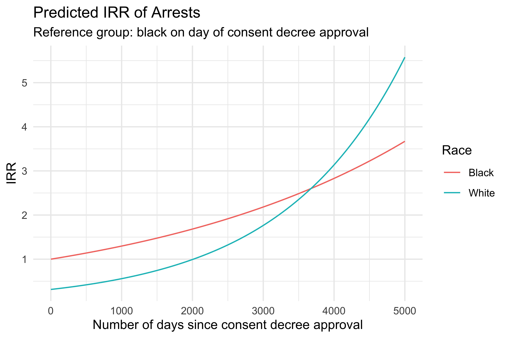
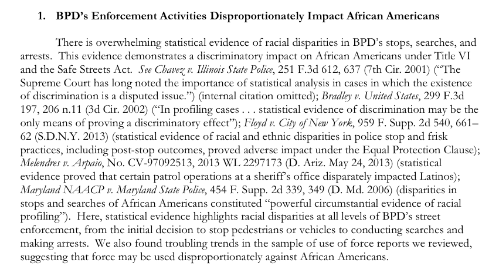

```{r setup, include=FALSE}
knitr::opts_chunk$set(echo = TRUE)
```



# Must Do

+ Explain apply functions earlier so that functions can be applied across datasets easily and efficiently. 
+ Describe each dataset after loading it 
+ Need subheadings (should be able to go back to things easily)
+ Need more annotations
+ Discuss exclusion of data not used in this analysis ("freeze" the data)

# Leah: READ ME

**Michael**: I have included annotations such as this throughout thet case study. These were meant to highlight areas of where I may have a concern or am uncertain with how to proceed. 

Search "Michael:Leah" to find comments I have left for you

# Motivation 

In this case study, we will examine whether the consent decree between the Baltimore Police Department and the Department of Justice had an impact on arrest patterns in Baltimore City.

### Background

On April 12, 2015, Freddie Gray was arrested in West Baltimore for carrying a knife. A week after his arrest, Freddie Gray died. His death was attributed to injuries to the spinal cord. Six police officers present at his arrest were then suspended with pay and later had criminal charges filed against them. The Office of the Chief Medical Examiner determined that Freddie Gray's death was a result of a "high-energy injury" and that the death was a homicide by omission of care. As details of Freddie Gray's death became more publically known, protests ensued.

**Leah:Michael** Can we find a link to some reputable news sources that summarize this case and resulting protests? 

Shortly after, Mayor Stephanie Rawlings-Blake formally requested that the Department of Justice (DoJ) conduct an investigation of Baltimore's policing practices. The DoJ, after a yearlong investigation, found that the Baltimore Police Department (BPD) had engaged in multiple unconstitutional policing practices. On April 7, 2017, a judge approved a consent decree between BPD and the DoJ, which mandated, among other things, a series of restrictions on officers. 

The purpose of this consent decree was to ensure that the Baltimore Police Department resolves the unconstitutional policing practices identified by the DoJ investigation. Although court enforceable, its practical impact is still unknown largely because of the broad scope of its various components and the underlying complexity of each of those components. An excerpt from page 48 of [the DoJ's report](https://www.justice.gov/crt/file/883296/download) highlights the multiple infractions suspected of the Baltimore Police Department: 

---


---

(See this arcticle by the [Baltimore Sun](https://www.baltimoresun.com/news/crime/bs-md-ci-consent-decree-explainer-20180403-story.html) for more information about Baltimore's consent decree.)

## Learning objectives

In this case study, we will focus on the data science skills of data wrangling, data visualization, using regular expressions to work with text data, and modeling with Poisson regression. 

## R packages

The R packages used in this case study are listed below, along with a brief description of why we will use each each package.  Please ensure you have these packages installed before running this code.

+ `tidyverse`, for data wranging and summarization, amongst other things, from a number of packages
**Leah:Michael** Are we mostly just using `dplyr` here?  We should list the `tidyverse` packages we use separately, like with `ggplot2` below.

+ `ggplot2`, for creating visualizations

+ `lubridate`, for working with date/time data

+ `MASS`, for modeling with negative binomial regression

+ `stringr`, for handling regular expressions and working with text data

+ `kableExtra`, for creating HTML tables of results

+ `gridExtra`, for arranging multiple plots on a page

+ `cowplot`, for extending the functionality of `ggplot2`

# What is the data? 

We will analyze data from two sources:

+ [Open Baltimore](https://data.baltimorecity.gov/) is a web portal with Baltimore-specific data. The portal is city-managed and regularly updated. All arrest data from the Baltimore Police Department used in this analysis is made available on Open Baltimore [here](https://data.baltimorecity.gov/Public-Safety/BPD-Arrests/3i3v-ibrt).  The arrest data we use in this case study was last updated on September 3, 2019.

+ The [American Community Survey](https://www.census.gov/programs-surveys/acs) is an ongoing survey by the United States Census Bureau that captures demographic information for the United States and regions within. We will be using age, sex, and race data (tables B01001A and B01001B) for the county "Baltimore city, Maryland." This data is made available by the US Census Bureau [here](https://www.census.gov/data.html). 

# Data import {#data-import}

We start by loading the libraries we will need for this case study.

```{r, warning=FALSE, message=FALSE}
library(gridExtra)
library(lubridate)
library(stringr)
library(kableExtra)
library(cowplot)
library(ggplot2)
library(MASS)
library(tidyverse)
```

## Arrest data

We'll import the arrest data first. 


```{r}
BPD_Arrests <- read_csv("BPD_Arrests.csv")
```

Notice the number of parsing failures. `read_csv()` predicts the class of each column when loading data. Sometimes these predictions are difficult for `read_csv` to make when the data has errors and are resultantly error-prone.

Still, these predictions and errors are useful. With `read_csv()`, we can explicitly assign data classes. Having predictions beforehand allows us to identify potential data collection errors. This is particularly useful when a dataset has a very large number of observations. 

The `problems()` function from `read_csv` allows us to retrieve the problems identified when we first loaded our data. We can determine which columns are causing problems (and how many) with the `summary()` function, but not without some minor transformations of the data. 

Let us look at some of the problems in the dataset identified by `read_csv()`. Note that problems not identified by the function may exist and require more direct methods to identify them. 

```{r}
problems(BPD_Arrests)
```

By converting the `tibble` created by `read_csv()` into a dataframe using `as.data.frame`, we can then use the `as. factor()`. This changes the `col` column into a format `as.factor()` can comprehend. After this change has been made, the `summary()` function  can then create a count of parsing problems caused by each column in our original dataframe. 

If we don't do the above transformations, we get an error message.

```{r, error = TRUE}
summary(as.factor(problems(BPD_Arrests)[,"col"]))
```

This is because the the `problems()` function returns output with multiple classes. In some cases, having multiple classes can complicate the way in which functions are applied.

```{r}
class(problems(BPD_Arrests)[,"col"])
```

We can get around this with the `as.data.frame()` function.  

```{r}
summary(as.factor(as.data.frame(problems(BPD_Arrests))[,"col"]))
```

The `Latitude`, `Longitude`, and `Post` columns appear to be causing problems.

Let's look the columns we will be working with.

```{r}
colnames(BPD_Arrests)
```

As you can see, we have some demographic information about the person arrested. We also have some information about the nature of the arrest. Spatial data is also available. 

The object containing our data is currently a `tibble`. The `tibble` class is great for printing data neatly, but otherwise does not provide substantial advantages over the `dataframe` class. To get a peak at our data without any of the special formatting provided by the `tibble` class, we can use the functions `as.data.frame()` and `head()` to print all columns of data for the first several rows.  

```{r}
head(as.data.frame(BPD_Arrests))
```

Now that we know what data we are working with, let's specify the classes of our columns with `read_csv()`. 

We have the option to not read in some of the data while we are specifying the classes with `read_csv()`. This can be done with the `cols_only()` function, which specifies which columns to read in. 

If we run the code below, we get a parsing failure for each row with a date.

```{r}
BPD_Arrests <- read_csv("BPD_Arrests.csv",
                               col_types = cols_only(Age=col_character(),
                                                                          Sex=col_character(),
                                                                          Race=col_character(),
                                                                          ArrestDate=col_date()))
```

This is because `read_csv` cannot read in our date data, `ArrestDate`, in its current form.

For now, let's specify all of the columns we will be using as a `character class`.

Using the `character` class for data allows us to convert columns of our data to the appropriate class afterward without any formatting issues. This is particularly useful when data is not in a form that `read_csv()` can use to specify a particular class like in the case above. While this may add an additional step, it makes our analysis less error-prone.

Let's read in the data using this more conservative approach.

```{r}
BPD_Arrests <- read_csv("BPD_Arrests.csv",
                               col_types = cols_only(Age=col_integer(),
                                                                          Sex=col_character(),
                                                                          Race=col_character(),
                                                                          ArrestDate=col_character()))
```

Let's check if our `tibble` has any problems.

```{r}
length(as.factor(as.data.frame(problems(BPD_Arrests))[,"col"]))
```

## Population Data

We need population data to work with arrest rates rather than arrest counts.

Let's load the American Community Survey data we will be using for this analysis. Coming from a well-maintained database, the datasets from the American Community Survey follow a strict codebook. To avoid using uninterpretable headers that correspond to codes in the codebook, we will not use the first row to define our header.

[White Population](https://factfinder.census.gov/faces/tableservices/jsf/pages/productview.xhtml?pid=ACS_17_5YR_B01001A&prodType=table)

[Black Population](https://factfinder.census.gov/faces/tableservices/jsf/pages/productview.xhtml?pid=ACS_17_5YR_B01001B&prodType=table)

```{r}
BaltimoreWhitePop14 <- read_csv("ACS_14_5YR_B01001A_with_ann.csv",
                                col_names = FALSE)
length(as.factor(as.data.frame(problems(BaltimoreWhitePop14))[,"col"]))
```

```{r}
BaltimoreWhitePop15 <- read_csv("ACS_15_5YR_B01001A_with_ann.csv",
                                col_names = FALSE)
length(as.factor(as.data.frame(problems(BaltimoreWhitePop15))[,"col"]))
```

```{r}
BaltimoreWhitePop16 <- read_csv("ACS_16_5YR_B01001A_with_ann.csv",
                                col_names = FALSE)
length(as.factor(as.data.frame(problems(BaltimoreWhitePop16))[,"col"]))
```

```{r}
BaltimoreWhitePop17 <- read_csv("ACS_17_5YR_B01001A_with_ann.csv",
                                col_names = FALSE)
length(as.factor(as.data.frame(problems(BaltimoreWhitePop17))[,"col"]))
```

```{r}
BaltimoreBlackPop14 <- read_csv("ACS_14_5YR_B01001B_with_ann.csv",
                                col_names = FALSE)
length(as.factor(as.data.frame(problems(BaltimoreBlackPop14))[,"col"]))
```

```{r}
BaltimoreBlackPop15 <- read_csv("ACS_15_5YR_B01001B_with_ann.csv",
                                col_names = FALSE)
length(as.factor(as.data.frame(problems(BaltimoreBlackPop15))[,"col"]))
```

```{r}
BaltimoreBlackPop16 <- read_csv("ACS_16_5YR_B01001B_with_ann.csv",
                                col_names = FALSE)
length(as.factor(as.data.frame(problems(BaltimoreBlackPop16))[,"col"]))
```

```{r}
BaltimoreBlackPop17 <- read_csv("ACS_17_5YR_B01001B_with_ann.csv",
                                col_names = FALSE)
length(as.factor(as.data.frame(problems(BaltimoreBlackPop17))[,"col"]))
```

`read_csv()` did not recognize any problems while loading the population data. Given that the above population dataframes all follow a standardized format, it should not be of too much concern. This, however, does not mean that they do not require wrangling. We'll see later that the population dataframes, although much cleaner than our arrest dataframes, are not useful in their current state. 

## Size of dataframes

We then look at the dimensions of each dataframe to get a handle on how large and complicated the dataframes are. 

The dataframe for arrests in Baltimore has `r dim(BPD_Arrests)[1]` rows and `r dim(BPD_Arrests)[2]` columns.

```{r}
dim(BPD_Arrests)
```

The dataframes for the Baltimore populations should all be identically formatted. We can confirm this by taking a look at the dimensions for different year/Race combinations.

```{r}
dim(BaltimoreWhitePop14)==dim(BaltimoreWhitePop17)
dim(BaltimoreWhitePop14)==dim(BaltimoreBlackPop17)
```

The dataframes for the Baltimore populations each have `r dim(BaltimoreBlackPop14)[1]` rows and `r dim(BaltimoreBlackPop14)[2]` columns.

```{r}
dim(BaltimoreBlackPop14)
```

## Contents of dataframes

Let us take a look at what these dataframes contain. Applying functions that print output to multiple dataframes can produce a lot of output. We only need to look at one of the dataframes since they are identically formatted. We will use the last dataframe we produced since it would likely be most unlike the first dataframe we produced if there was a systematic error.

```{r}
head(BPD_Arrests)
```

```{r}
head(BaltimoreBlackPop17)
```

Now that we know a little bit about our dataframes, we can begin the process of transforming them for our analysis.

# Data wrangling 

Since three dataframes will be used for this analysis, it is important that we identify the role of each before continuing.

Simply put, we will be analyzing temporal trends in arrests while adjusting for the size of subpopulations using an offset. Our final dataframe should therefore have two components:

+ 1.0 Arrest data
    + 1.1 Open Baltimore Arrest Data
+ 2.0 Population data
    + 2.1 White population data
    + 2.2 Black population data

For our poisson regression, we need each of these components to be grouped in such a way that would allow them to be combined to make our final dataframe. 

Let us create a quick workflow.

## Workflow 

-----

We'll begin by making each of the three dataframes more practical to use. Then we'll combine the population datasets to make a population dataframe. Lastly, we'll create a final dataframe by grouping the arrest and population dataframes similarly and then combine the two.

-----

## Arrest data

**Making the arrest data more practical**

We'll begin with the arrest data.

We need to know what type of data we are working with to appropriately work with out data.

Rather than use the `class()` function for each individual variable, we can use `lapply()` to apply the `class()` function to all of our columns. This will save us `r length(colnames(BPD_Arrests))-1` lines of code.

```{r}
lapply(BPD_Arrests[,1:length(colnames(BPD_Arrests))],class)
```

It looks like some of our variables are not specified correctly. This makes sense since we read the columns in as character classes. 

Using `as.Date`, let's make sure R recognizes that the data is in month-day-year format.

```{r}
BPD_Arrests$ArrestDate <- as.Date(BPD_Arrests$ArrestDate,"%m/%d/%Y")
```

Now we do the same thing for our other variables, using the appropriate functions to designate appropriate classes for our data.

```{r}
BPD_Arrests$Sex <- as.factor(BPD_Arrests$Sex)
BPD_Arrests$Race <- as.factor(BPD_Arrests$Race)
```

We need to know a bit more about the values in each column before going forward with assigning levels to our factors class columns.

```{r}
lapply(BPD_Arrests[,1:length(colnames(BPD_Arrests))],
       summary)
```

We are now ready to assign levels to our factor class columns. For this analysis, we will only use arrest and population data for the black and white populations in Baltimore. Our dataset still contains information for arrests of people of other races. We need to exclude this data. 

```{r}
BPD_Arrests$Sex <- factor(BPD_Arrests$Sex,
                                 levels = c("F", "M"),
                                 labels=c("Female", "Male"))
BPD_Arrests <- BPD_Arrests[BPD_Arrests$Race=="B"|BPD_Arrests$Race=="W",]
BPD_Arrests$Race <- factor(BPD_Arrests$Race,
                                  levels = c("B", "W"),
                                  labels = c("Black", "White"))
```

Let's look at our dataframe again.

```{r}
head(BPD_Arrests)
```

## Population data

We'll group this final dataframe once we know the limitations of our population data. 

**Making the population data more practical**

Sometimes imported dataframes follow a rigorous codified format. This is more than often the case with very well maintained data. Codified dataframes often require a corresponding codebook.

We imported the dataframes without designating headers for this very reason. Census dataframes are often codified and contain a second set of headers for practical use. Although making the dataframe more functional is still possible without this step, importing the data in this way saves us a few steps.

Our arrest data has practical field names and no second set of headers. Our census data has two sets of headers. 

The first rows of the census data we imported are codified while the second rows are practically named. 

```{r}
head(BaltimoreWhitePop14)
```

We will use the second rows of the census data as field names. This will allow different fields to be easily discernable from one another. 
This can be done simply by treating the second row as a list comprised of character class items. 

We'll begin with the white population data for 2014. We only want to work with one dataframe for now. Later we can explore the use of a "custom" function to suit our needs 

```{r}
colnames(BaltimoreWhitePop14) <- as.character(BaltimoreWhitePop14[2,])
colnames(BaltimoreWhitePop14[,1:5])
```

For each column, there is a field name, the original codified row, and the practical row we used to designate our field names. We can remove the original codified row and the second row that we used to create our field names now that they have been created and saved. 

```{r}
BaltimoreWhitePop14 <- BaltimoreWhitePop14[-(1:2),]
```

The census dataframes we imported are grouped by age group and gender. Each estimate has a corresponding margin of error. For this analysis, we will only be using the provided estimates. 

For efficiency, we should discard any data that will not be used in our analysis. We could manually remove one column at a time with multiple lines of code. This would take some time and and may involve some trial and error. 

Instead, we will use `substr` to take our character class field names and identify the fields we will need. 

This takes advantage of a programming concept known as [regular expressions](https://en.wikipedia.org/wiki/Regular_expression?oldformat=true). Simply put, a sequence of text in the data. 

`substr` searches for a distinct character string, a regular expressions, within a portion of the characters in a string. Below, we search for `Estimate` within the 1^st^ through 8^th^ characters in each field name and then save the columns that meet that criteria. This leaves out the columns beginning with `Margin of Error`. We also save and rename the `Geography` column as good practice. Rownames are removed to avoid later confusion. 

```{r}
Geography <- BaltimoreWhitePop14$Geography
BaltimoreWhitePop14 <- cbind(Geography,
        BaltimoreWhitePop14[, substr(colnames(BaltimoreWhitePop14),1,8)=="Estimate"])
rownames(BaltimoreWhitePop14) <- c()
head(BaltimoreWhitePop14[,1:5])
```

Let us look at our new column names.

```{r, echo=FALSE}
colnames(BaltimoreWhitePop14)
```

`"Estimate; "` is in nearly every column name in our new dataframe. Let's remove it to have an even more practical dataframe. To do this, we will use `str_remove` from the `stringr` package.

```{r}
colnames(BaltimoreWhitePop14) <- str_remove(colnames(BaltimoreWhitePop14),"Estimate; ")
```

Our new column names are much simpler.

```{r}
colnames(BaltimoreWhitePop14)
```

Let's remove symbols, spaces, and `years` from our field names. The expression `[[:punct:]]` encompasses a wide range of symbols. `str_replace_all` differs from `str_replace` in that it is used to replace patterns for the entire string. A number of resources exist online showing the ways we can use regular expressions (click [here](http://web.mit.edu/hackl/www/lab/turkshop/slides/regex-cheatsheet.pdf) to see this great MIT resource).

```{r}
colnames(BaltimoreWhitePop14) <- str_replace_all(colnames(BaltimoreWhitePop14), "[[:punct:]]", "")
colnames(BaltimoreWhitePop14) <- str_replace_all(colnames(BaltimoreWhitePop14), " ", "")
colnames(BaltimoreWhitePop14) <- str_replace_all(colnames(BaltimoreWhitePop14), "years", "")
```

Now our column names are practical and concise.

```{r}
colnames(BaltimoreWhitePop14)
```

We need to organize our dataframe to have a single column for age group and a single column gender. This data format is known as *long format* and is required to efficiently create data visualizations with the `ggplot` package. Doing this will also allow us to use more appropriate variables such as age group and gender as well as the specific age group-gender combinations the dataframe currently provides. 

Our dataframe is still a bit messy. It is currently in wide format has two variables of interest in nearly every column. We need to get our dataframe into long format and remove the variable pairings. To do this we will have to collapse the Population data gathered across columns into a single column current combinations and use this column to create a dataframe with age group and gender columns.

```{r}
molten.BaltimoreWhitePop14 <- BaltimoreWhitePop14 %>% gather(key=AgeGroupGender,
                                                         value=Population,
                                                         -Geography)
head(molten.BaltimoreWhitePop14)
```

Let us remove rows with from `variable` representing totals for each variable. This will simplify the summaries we create later with `dplyr`.

```{r}
molten.BaltimoreWhitePop14 <- molten.BaltimoreWhitePop14[molten.BaltimoreWhitePop14$AgeGroupGender!="Total",]
molten.BaltimoreWhitePop14 <- molten.BaltimoreWhitePop14[molten.BaltimoreWhitePop14$AgeGroupGender!="Male",]
molten.BaltimoreWhitePop14 <- molten.BaltimoreWhitePop14[molten.BaltimoreWhitePop14$AgeGroupGender!="Female",]
```

Now, let us create two empty columns, `AgeGroup` and `Gender`.

```{r}
molten.BaltimoreWhitePop14$AgeGroup <- NA
molten.BaltimoreWhitePop14$Gender <- NA
head(molten.BaltimoreWhitePop14)
```

Let us now fill our `AgeGroup` and `Gender` columns with information from our `variable` column. 

To do this we will we will identify patterns within strings and use those specific pattern to fill up our `AgeGroup` and `Gender` columns. This will involve using the `substr()` function along with an ifelse() statement for each of our columns. We will check whether our ifelse() functions worked by combining the `sum()` and `is.na()` functions.

```{r}
molten.BaltimoreWhitePop14$AgeGroupGender <- as.character(molten.BaltimoreWhitePop14$AgeGroupGender)
molten.BaltimoreWhitePop14$Gender <- ifelse(substr(molten.BaltimoreWhitePop14$AgeGroupGender,1,4)=="Male", "Male",
                                          ifelse(substr(molten.BaltimoreWhitePop14$AgeGroupGender,1,6)=="Female","Female",
                                                 NA
       )
)
molten.BaltimoreWhitePop14$AgeGroup <- ifelse(substr(molten.BaltimoreWhitePop14$AgeGroupGender,1,4)=="Male", str_replace_all(molten.BaltimoreWhitePop14$AgeGroupGender,"Male",""),
                                            ifelse(substr(molten.BaltimoreWhitePop14$AgeGroupGender,1,6)=="Female", str_replace_all(molten.BaltimoreWhitePop14$AgeGroupGender,"Female",""),
                                                   NA)
                                            )
head(molten.BaltimoreWhitePop14)
```

We can get rid of extraneous fields now that we have the fields we need.

```{r}
molten.BaltimoreWhitePop14$AgeGroupGender <- NULL
```

Recall leaving the `Geography` column as good practice. Leaving columns specific to a dataframe allow the dataframe to be easily identified from other dataframes after merging. We will be merging this dataframe to the other census dataframe to create a new dataframe with the population demographics we will be adjusting for in our analysis. To help identify which race this dataframe is specific to, we will add a new column, `Race`, with an appropriate factor.

```{r}
molten.BaltimoreWhitePop14$Race <- as.factor("White")
molten.BaltimoreWhitePop14$Year <- as.numeric("2014")
```

Our `Population` variable should be last in our dataframe. `dplyr` could be helpful for this purpose. Let's select/subset the entire dataframe and conveniently reorder our columns. Notice that quotation marks are not necessary after piping with `dplyr`.

```{r}
molten.BaltimoreWhitePop14 <- molten.BaltimoreWhitePop14 %>%
  arrange(Geography,
          AgeGroup,
          Gender,
          Race,
          Population,
          Year)
```

Let us take a quick look at our progress thus far.

```{r}
head(molten.BaltimoreWhitePop14)
```

For practicality, we will overwrite the prior dataframe. 

```{r}
BaltimoreWhitePop14 <- molten.BaltimoreWhitePop14
```

If our two dataframes are identically formatted, the data wrangling steps we have made up to this point can be repeated to yield a similar dataframe without error.

```{r}
colnames(BaltimoreBlackPop14) <- as.character(unlist(BaltimoreBlackPop14[2,]))
BaltimoreBlackPop14 <- BaltimoreBlackPop14[-(1:2),]
Geography <- BaltimoreBlackPop14$Geography
BaltimoreBlackPop14 <- cbind(Geography,
        BaltimoreBlackPop14[, substr(colnames(BaltimoreBlackPop14),1,8)=="Estimate"])
rownames(BaltimoreBlackPop14) <- c()
colnames(BaltimoreBlackPop14) <- str_remove(colnames(BaltimoreBlackPop14),
                                          "Estimate; ")
colnames(BaltimoreBlackPop14) <- str_replace_all(colnames(BaltimoreBlackPop14),
                                               "[[:punct:]]", "")
colnames(BaltimoreBlackPop14) <- str_replace_all(colnames(BaltimoreBlackPop14), " ", "")
colnames(BaltimoreBlackPop14) <- str_replace_all(colnames(BaltimoreBlackPop14),
                                               "years", "")
molten.BaltimoreBlackPop14 <- BaltimoreBlackPop14 %>%
  gather(key=AgeGroupGender,
         value=Population,
         -Geography)
molten.BaltimoreBlackPop14 <- molten.BaltimoreBlackPop14[molten.BaltimoreBlackPop14$AgeGroupGender!="Total",]
molten.BaltimoreBlackPop14 <- molten.BaltimoreBlackPop14[molten.BaltimoreBlackPop14$AgeGroupGender!="Male",]
molten.BaltimoreBlackPop14 <- molten.BaltimoreBlackPop14[molten.BaltimoreBlackPop14$AgeGroupGender!="Female",]
molten.BaltimoreBlackPop14$AgeGroup <- NA
molten.BaltimoreBlackPop14$Gender <- NA
molten.BaltimoreBlackPop14$AgeGroupGender <- as.character(molten.BaltimoreBlackPop14$AgeGroupGender)
molten.BaltimoreBlackPop14$Gender <- ifelse(substr(molten.BaltimoreBlackPop14$AgeGroupGender,1,4)=="Male", "Male",
                                          ifelse(substr(molten.BaltimoreBlackPop14$AgeGroupGender,1,6)=="Female", "Female",
                                                 NA
       )
)
molten.BaltimoreBlackPop14$AgeGroup <- ifelse(substr(molten.BaltimoreBlackPop14$AgeGroupGender,1,4)=="Male", str_replace_all(molten.BaltimoreBlackPop14$AgeGroupGender, "Male", ""),
                                            ifelse(substr(molten.BaltimoreBlackPop14$AgeGroupGender,1,6)=="Female", str_replace_all(molten.BaltimoreBlackPop14$AgeGroupGender,"Female",""),
                                                   NA)
                                            )
molten.BaltimoreBlackPop14$AgeGroupGender <- NULL
molten.BaltimoreBlackPop14$Race <- as.factor("Black")
molten.BaltimoreBlackPop14$Year <- as.numeric("2014")
molten.BaltimoreBlackPop14 <- molten.BaltimoreBlackPop14 %>%
  arrange(Geography,
          AgeGroup,
          Gender,
          Race,
          Population,
          Year)
BaltimoreBlackPop14 <- molten.BaltimoreBlackPop14
head(BaltimoreBlackPop14)
```

As you can see, after repeating the same data wrangling steps, the second dataframe is similarly formatted. 

Now that we've confirmed that our code works across dataframes, we can repeat the successful wrangling steps for the rest of the population datasets efficiently with a function.

To do this, we need to identify areas where the data wrangling code may be different. Given that the population datasets are identically formatted but named differently, our function should be able to complete the wrangling process with a few arguments related to the naming conventions of our dataframes.

Essentially, we use whatever code we applied to one of the two dataframes wrangled above and modify the code to accept the appropriate variations of the dataset we intend to create.

Combining the `paste0()` function with `as.name()` lets us name objects within our function in a way that mirrors the initial wrangling we did without a function. 

Lastly, when creating functions it's important that error messages with relevant information be returned. Our function below takes a dataframe. If a different object class is inserted into our function, it's important that we recognize that with a returned error message. Using `if()` and `stop()` functions allows us to create custom error messages for specific shortfalls we may encounter.

Below is the function to wrangle our data. Aside from the embedded error message capability, use of `paste0` and `as.name()` to create object names, and the use of the `return()` function in place of the `head()` function, the code is identical to the code we used earlier. 

```{r}
ACSdatawrnglr <- 
function(DATAFRAME, RACE, YEAR){
  if(is.data.frame(DATAFRAME)==FALSE){stop("Not a dataframe")}
  colnames(DATAFRAME) <- as.character(unlist(DATAFRAME[2,]))
  DATAFRAME <- DATAFRAME[-(1:2),]
  Geography <- DATAFRAME$Geography
  DATAFRAME <- cbind(Geography,
        DATAFRAME[, substr(colnames(DATAFRAME),1,8)=="Estimate"])
  rownames(DATAFRAME) <- c()
  colnames(DATAFRAME) <- str_remove(colnames(DATAFRAME),
                                          "Estimate; ")
  colnames(DATAFRAME) <- str_replace_all(colnames(DATAFRAME),
                                               "[[:punct:]]", "")
  colnames(DATAFRAME) <- str_replace_all(colnames(DATAFRAME), " ", "")
  colnames(DATAFRAME) <- str_replace_all(colnames(DATAFRAME),
                                               "years", "")
  molten.DATAFRAME <- as.name(paste0("molten.", DATAFRAME))
  molten.DATAFRAME <- DATAFRAME %>%
  gather(key=AgeGroupGender,
         value=Population,
         -Geography)
  molten.DATAFRAME <- molten.DATAFRAME[molten.DATAFRAME$AgeGroupGender!="Total",]
  molten.DATAFRAME <- molten.DATAFRAME[molten.DATAFRAME$AgeGroupGender!="Male",]
  molten.DATAFRAME <- molten.DATAFRAME[molten.DATAFRAME$AgeGroupGender!="Female",]
  molten.DATAFRAME$AgeGroup <- NA
  molten.DATAFRAME$Gender <- NA
  molten.DATAFRAME$AgeGroupGender <- as.character(molten.DATAFRAME$AgeGroupGender)
  molten.DATAFRAME$Gender <- ifelse(substr(molten.DATAFRAME$AgeGroupGender,1,4)=="Male", "Male",
                                          ifelse(substr(molten.DATAFRAME$AgeGroupGender,1,6)=="Female", "Female",
                                                 NA
       )
)
  molten.DATAFRAME$AgeGroup <- ifelse(substr(molten.DATAFRAME$AgeGroupGender,1,4)=="Male", str_replace_all(molten.DATAFRAME$AgeGroupGender, "Male", ""),
                                            ifelse(substr(molten.DATAFRAME$AgeGroupGender,1,6)=="Female", str_replace_all(molten.DATAFRAME$AgeGroupGender,"Female",""),
                                                   NA)
                                            )
  molten.DATAFRAME$AgeGroupGender <- NULL
  molten.DATAFRAME$Race <- as.factor(RACE)
  molten.DATAFRAME$Year <- as.numeric(YEAR)
  molten.DATAFRAME <- molten.DATAFRAME %>%
  arrange(Geography,
          AgeGroup,
          Gender,
          Race,
          Population)
  DATAFRAME <- molten.DATAFRAME
  return(DATAFRAME)
}
```

Let's put our `ACSdatawranglr()` function to use. As you can see, we receive an error message if an object that is not a dataframe is entered into our function. 

```{r, error=TRUE}
OCSvector <- as.vector(c("O", "C", "S"))
ABC <- ACSdatawrnglr(OCSvector)
BaltimoreWhitePop15 <- ACSdatawrnglr(BaltimoreWhitePop15, "White", "2015")
BaltimoreWhitePop16 <- ACSdatawrnglr(BaltimoreWhitePop16, "White", "2016")
BaltimoreWhitePop17 <- ACSdatawrnglr(BaltimoreWhitePop17, "White", "2017")
BaltimoreBlackPop15 <- ACSdatawrnglr(BaltimoreBlackPop15, "Black", "2015")
BaltimoreBlackPop16 <- ACSdatawrnglr(BaltimoreBlackPop16, "Black", "2016")
BaltimoreBlackPop17 <- ACSdatawrnglr(BaltimoreBlackPop17, "Black", "2017")
```

Before we continue, we need to ensure that the dataframes we've produced are what we intended. We will take the last dataframe we produced and determine whether the output looks correct.

```{r}
head(BaltimoreBlackPop17[1:5])
```

Let's combine demographic data from the two to create a dataframe from which to base our offset for our regression analysis. We will use `bind_rows` from the `dplyr` package. 

```{r}
demographics <- rbind(BaltimoreWhitePop14,
                      BaltimoreWhitePop15,
                      BaltimoreWhitePop16,
                      BaltimoreWhitePop17,
                      BaltimoreBlackPop14,
                      BaltimoreBlackPop15,
                      BaltimoreBlackPop16,
                      BaltimoreBlackPop17)
head(demographics)
```

Oops! We did some serious wrangling and have not checked our column classes. Let's save some time and apply the `class()` function to all columns of our new dataframe to see whether we inadvertently made some changes along the way that can complicate further wrangling. 

```{r}
lapply(demographics[,1:length(colnames(demographics))],
       class)
```

Our `Gender`, `AgeGroup`, and `Population` columns are incorrectly specificed as `character` classes. `Gender` and `AgeGroup` should each be a `factor`. `Population` should be a `numeric`.

We are about to use `dplyr` and `ggplot` for exploratory data analysis. Now would be a good time to fix this. 

```{r}
demographics[,c("Gender","AgeGroup")] <- lapply(demographics[,c("Gender","AgeGroup")],
                                                       as.factor)

demographics$Population <- as.numeric(demographics$Population)
lapply(demographics[,1:length(colnames(demographics))],
       class)
```

The `head()` function only returns several of the uppermost rows, meaning that we are not be able to assess what happened to our rows after we used the `bind_rows()` function. We loaded the `dplyr` package for data summarization. If our dataframes were bound and specified correctly, we should be able to accurately recreate summaries of the data. Let's use the `group_by`,`summarise()`, and `mutate()` functions to do just that. In 2017, Baltimore was roughly 30% White and 63% Black (see the [US Census Estimates for Baltimore City](https://factfinder.census.gov/faces/tableservices/jsf/pages/productview.xhtml?pid=ACS_17_5YR_B02001&prodType=table)). If we bound and specified our dataframes correctly, we should be able to generate similar figures.

In 2017, about 93% of Baltimore was either White or Black. Let us use that information and compare it to the [US Census Estimates for Baltimore City](https://factfinder.census.gov/faces/tableservices/jsf/pages/productview.xhtml?pid=ACS_17_5YR_B02001&prodType=table).

```{r}
TotalPopulationMultiplier <- (100/93)
demographics %>%
  filter(Year==2017) %>%
  group_by(Race) %>%
  summarise(n=sum(Population)) %>%
  mutate(Percent = n/(sum(n)*(TotalPopulationMultiplier)))
```

Our figures are consistent with those by the census. 

```{r}
head(demographics)
```

## Creating analysis dataframe

### Defining variable categories

We need to group the arrest and population data similarly so that we can merge information from both dataframes into a single dataframe for analysis. 

To group our dataframes properly, we need to know the ways they are similar and the ways they are different. 

```{r}
colnames(demographics)
colnames(BPD_Arrests)
```

Our dataframes are similar in the following ways: 

+ Both have information by sex or gender. **Insert disclaimer about police department using sex and not gender**

+ Both have information by race. 

+ Both have information pertaining to age. 

+ Both have temporal information.

Our dataframes are different in the following ways: 

+ Our demographic data defines age by categorical groups and not in discrete values (as in the arrest data). 

+ Our demographic data has information for the Black and White population in Baltimore, whereas our arrest data includes arrests of people of other races. 

Before grouping, we need to define age similarly for both dataframes. We need to do this while preserving the temporal information provided by the arrest data. 

Now let's recode the age information provided by the arrest data by the age groups used in the demographic data. 

```{r}
levels(demographics$AgeGroup)
demographics <- demographics[demographics$AgeGroup!="Under5",]
demographics <- demographics[demographics$AgeGroup!="5to9",]
demographics <- demographics[demographics$AgeGroup!="10to14",]
demographics <- demographics[demographics$AgeGroup!="15to17",]
demographics$AgeGroup <- factor(demographics$AgeGroup, levels = c("18and19",
                                                "20to24",
                                                "25to29",
                                                "30to34",
                                                "35to44",
                                                "45to54",
                                                "55to64",
                                                "65to74",
                                                "75to84",
                                                "85andover"),
                       ordered = TRUE)
lapply(demographics, levels)
```

How do our levels compare?

```{r}
lapply(BPD_Arrests, levels)
```

```{r}
BPD_Arrests <- BPD_Arrests[BPD_Arrests$Age>=18,]
BPD_Arrests <- BPD_Arrests[is.na(BPD_Arrests$Age)==FALSE,]
BPD_Arrests$Age <- cut(BPD_Arrests$Age, breaks=c(17,
                                                               19,
                                                               24,
                                                               29,
                                                               34,
                                                               44,
                                                               54,
                                                               64,
                                                               74,
                                                               84,
                                                               Inf),
                              labels=levels(demographics$AgeGroup),
                              ordered_result = TRUE,
                              include.lowest = FALSE)
summary(BPD_Arrests$Age)
```

We need a way to link the arrest year to the population year.

```{r}
BPD_Arrests$Year <- year(BPD_Arrests$ArrestDate)
```

Let's change the names of the `Age` and `Sex` variables.

```{r}
colnames(BPD_Arrests)[colnames(BPD_Arrests)=="Age"] <- c("AgeGroup")
colnames(BPD_Arrests)[colnames(BPD_Arrests)=="Sex"] <- c("Gender")
colnames(BPD_Arrests)
```

We don't have population data for 2018 and 2019. If we assume that the change in the age distribution is constant for the years of interest, we can estimate the counts we need for our analysis.

### Estimating missing population data

```{r}
demographics %>% group_by(Race, Gender, AgeGroup, Year) %>% ggplot(aes(x = AgeGroup, y = Population, fill = Gender)) + 
  geom_bar(data = subset(demographics, Gender == "Female"), stat = "identity") + 
  geom_bar(data = subset(demographics, Gender == "Male"), stat="identity", aes(y=Population*-1)) + 
  scale_y_continuous(breaks=seq(-40000,40000,20000),labels=seq(-40, 40, 20)) + 
  coord_flip() +
  facet_wrap(Year~.) + 
  theme_minimal() +
  ggtitle("Population Pyramid for Baltimore", subtitle = "Minors excluded") +
  ylab("Population (in Thousands)") +
  xlab("Age Group")
```

```{r}
demographics17_19 <- demographics %>%
  group_by(Race, Gender, AgeGroup) %>%
  mutate(Yearly_delta = (subset(Population, Year==2017)-subset(Population, Year==2014))/4) %>%
  filter(Year==2017) %>%
  mutate(projection2018=round(Population + Yearly_delta*1,0), projection2019=round(projection2019=Population + Yearly_delta*2))

demographics18_19 <- demographics17_19 %>%
  ungroup()%>%
  select(Geography, AgeGroup, Gender, Race, projection2018, projection2019) %>%
  gather(key=Year, value = Population,
         -Geography,
         -AgeGroup,
         -Gender,
         -Race) %>%
  mutate(Year=recode(Year, projection2018=2018, projection2019=2019))

demographics <- bind_rows(demographics, demographics18_19)
```

We now have all the population data we need.

```{r}
demographics %>% group_by(Race, Gender, AgeGroup, Year) %>% ggplot(aes(x = AgeGroup, y = Population, fill = Gender)) + 
  geom_bar(data = subset(demographics, Gender == "Female"), stat = "identity") + 
  geom_bar(data = subset(demographics, Gender == "Male"), stat="identity", aes(y=Population*-1)) + 
  scale_y_continuous(breaks=seq(-40000,40000,20000),labels=seq(-40, 40, 20)) + 
  coord_flip() +
  facet_wrap(Year~.) + 
  theme_minimal() +
  ggtitle("Population Pyramid for Baltimore", subtitle = "Minors excluded") +
  ylab("Population (in Thousands)") +
  xlab("Age Group")
```

### Merging the dataframes

Now we can group and combine the data.

```{r}
ArrestData <- BPD_Arrests %>%
  group_by_all() %>%
  summarise(Arrests=n())
DemographicData <- demographics %>%
  group_by_at(vars(Gender,
                   AgeGroup,
                   Race,
                   Population,
                   Year))

AnalysisDF <- ArrestData %>% left_join(DemographicData,by=c("Gender","AgeGroup","Race","Year"))
head(AnalysisDF)
```

Because we'll be analyzing temporal data, we should convert our temporal data into various units for analysis. 

```{r}
AnalysisDF <- AnalysisDF %>%
  mutate(ArrestDay = floor_date(ArrestDate,"day"),
                                    ArrestWeekday=weekdays(ArrestDate),
                                    ArrestWeek=floor_date(ArrestDate,"week"),
                                  ArrestMonth=floor_date(ArrestDate,"month"),
                          ArrestQuarter=floor_date(ArrestDate,"quarter"),
                          ArrestSeason=floor_date(ArrestDate,"season"),
                          ArrestYear=floor_date(ArrestDate,"year"))

AnalysisDF$ArrestWeekday <- factor(AnalysisDF$ArrestWeekday,
                                   levels = c("Sunday",
                                              "Monday",
                                              "Tuesday",
                                              "Wednesday",
                                              "Thursday",
                                              "Friday",
                                              "Saturday"),
                                   labels = c("Sun",
                                              "Mon",
                                              "Tue",
                                              "Wed",
                                              "Thu",
                                              "Fri",
                                              "Sat"),
                                   ordered = TRUE)

head(AnalysisDF)
```

Let's explore the data! 

# Exploratory data analysis

## Arrests over time

Let's see if any related historical events coincided with changes in arrests.

Our data is currently grouped by date in `%Y/%m/%d` format. Given the number of arrests in our dataset, it's likely that these arrests cover most if not all days in between 2014 and 2018. For visualization purposes, this may offer too high of a resolution to see any patterns that may exist. 

**Visit this [stackoverflow](https://stackoverflow.com/questions/18091721/align-geom-text-to-a-geom-vline-in-ggplot2) document to learn how to implement this more elegantly**

```{r, message=FALSE}
AnalysisDF %>% group_by(ArrestDate) %>% mutate(n=sum(Arrests)) %>% ggplot(aes(x = ArrestDate, y=n))+
  geom_point(size=0.1, color="gray")+
  geom_smooth(color="black")+
  xlab('')+
  ylab('Arrests')+
  geom_text(aes(x=as.Date("2014-07-09"),y=60,label="Death of Michael Brown"), color="red", angle=90, nudge_x = -50) +
  geom_vline(xintercept = as.Date("2014-07-09"), color="black", linetype="dashed")+
  geom_text(aes(x=as.Date("2015-04-12"),y=125,label="Death of Freddie Gray"), color="red", angle=90, nudge_x = -50) +
  geom_vline(xintercept = as.Date("2015-04-12"), color="black", linetype="dashed")+
  geom_text(aes(x=as.Date("2017-04-07"),y=125,label="Consent Decree Approval"), color="red", angle=90, nudge_x = -50) + 
  geom_vline(xintercept = as.Date("2017-04-07"), color="black", linetype="dashed")+
  ggtitle("Arrests/Day in Baltimore") +
  theme(legend.position = "bottom", legend.direction = "vertical")+
  theme_minimal()
```

The death of Michael Brown (August of 2014) appears to immediately precede sharp declines in the number of arrests. Interestingly, the death of Freddie Gray (April of 2015) does not appear to correspond to a decrease in daily arrests. Overall, there is a long term decrease in arrests over time.

`geom_smooth` can often oversmooth our data, reducing its variance, meaning we may not be able to see any small scale variation that could be relevant for our analysis.

We can create several plots to visualize the trend from the plot above at varying resolutions. This could help us identify additional trends in our data. 

We can use `gridExtra` to place all these plots in a single plot. This saves us output and makes the process of comparing and contrasting the plots easier. 

```{r}
day <- AnalysisDF %>%
  group_by(day=ArrestDay) %>% mutate(n=sum(Arrests)) %>%
  ggplot(aes(x=day, y=n))+
  geom_line(color="red")
```

```{r}
week <- AnalysisDF %>%
  group_by(week=ArrestWeek) %>%
  mutate(n=sum(Arrests)) %>%
  ggplot(aes(x=week, y=n))+
  geom_line(color="purple")
```

```{r}
month <- AnalysisDF %>%
  group_by(month=ArrestMonth) %>%
  mutate(n=sum(Arrests)) %>%
  ggplot(aes(x=month, y=n))+
  geom_line(color="green")
```

```{r}
quarter <- AnalysisDF %>%
  group_by(quarter=ArrestQuarter) %>%
  mutate(n=sum(Arrests)) %>%
  ggplot(aes(x=quarter, y=n))+
  geom_line(color="pink")
```

```{r}
season <- AnalysisDF %>%
  group_by(season=ArrestQuarter) %>%
  mutate(n=sum(Arrests)) %>%
  ggplot(aes(x=season, y=n))+
  geom_line(color="blue")
```

```{r}
year <- AnalysisDF %>%
  group_by(year=ArrestYear) %>%
  mutate(n=sum(Arrests)) %>%
  ggplot(aes(x=year, y=n))+
  geom_line(color="orange")
```

```{r}
grid.arrange(day,week,month,quarter,season,year,nrow=3,ncol=2,top="Arrests over time by different resolutions")
```

It looks like using month units works well for observing large and small scale variation. We will use this unit to explore the data some more temporally. Note that our decision to use this unit is strictly for vizualization purposes and does not necessarily mean that any specific pattern exists for statistical purposes. 

## Arrests by subpopulation

Let's examine our arrest data by group of interest. Because our outcome of interest will be a rate, we need to identify small subpopulations. These small can make some of our model coefficients very unstable, especially given a high number of degrees of freedom.

We create three plots that summarize the proportion of the population that falls under each category in our three categorical variables of interest. Then we create a plot that summarizes the proportion of the population that falls under a unique combination of these three categorical variables. 

The arrests data appears to be disproportionately young, black, and male. 

```{r}

AnalysisDF %>% group_by_at(vars(Race, Gender, AgeGroup)) %>%
  summarise(n=sum(Arrests)) %>% mutate(Race_=Race,Gender_=Gender,AgeGroup_=AgeGroup) %>%
  unite(Race_Gender_AgeGroup, c("Race","Gender","AgeGroup"), sep = "/") %>%
  mutate(prop=n/sum(n)) %>%
ggplot(aes(x=AgeGroup_,y=prop,fill=AgeGroup_)) +
  xlab("Age Group") +
  ylab("Inverse Proportion") +
  geom_bar(stat="identity",width = 0.5) +
  theme(axis.text.x.bottom = element_blank(),
        axis.ticks.x.bottom = element_blank()) + 
  ggtitle(label = "Proportion of Population by Subpopulation", subtitle = "By Age Group")

AnalysisDF %>% group_by_at(vars(Race, Gender, AgeGroup)) %>%
  summarise(n=sum(Arrests)) %>% mutate(Race_=Race,Gender_=Gender,AgeGroup_=AgeGroup) %>%
  unite(Race_Gender_AgeGroup, c("Race","Gender","AgeGroup"), sep = "/") %>%
  mutate(prop=n/sum(n)) %>%
ggplot(aes(x=Race_,y=prop,fill=Race_)) +
  xlab("Race") +
  ylab("Inverse Proportion") +
  geom_bar(stat="identity",width = 0.5) +
  theme(axis.text.x.bottom = element_blank(),
        axis.ticks.x.bottom = element_blank()) + 
  ggtitle(label = "Proportion of Population by Subpopulation", subtitle = "By Race")

AnalysisDF %>% group_by_at(vars(Race, Gender, AgeGroup)) %>%
  summarise(n=sum(Arrests)) %>% mutate(Race_=Race,Gender_=Gender,AgeGroup_=AgeGroup) %>%
  unite(Race_Gender_AgeGroup, c("Race","Gender","AgeGroup"), sep = "/") %>%
  mutate(prop=n/sum(n)) %>%
ggplot(aes(x=Gender_,y=prop,fill=Gender_)) +
  xlab("Gender") +
  ylab("Inverse Proportion") +
  geom_bar(stat="identity",width = 0.5) +
  theme(axis.text.x.bottom = element_blank(),
        axis.ticks.x.bottom = element_blank()) + 
  ggtitle(label = "Proportion of Population by Subpopulation", subtitle = "By Gender")

AnalysisDF %>% group_by_at(vars(Race, Gender, AgeGroup)) %>%
  summarise(n=sum(Arrests)) %>% mutate(Race_=Race,Gender_=Gender,AgeGroup_=AgeGroup) %>%
  unite(Race_Gender_AgeGroup, c("Race","Gender","AgeGroup"), sep = "/") %>%
  mutate(prop=n/sum(n)) %>%
ggplot(aes(x=AgeGroup_,y=prop,fill=AgeGroup_)) +
  xlab("Age Group") +
  ylab("Inverse Proportion") +
  geom_bar(stat="identity",width = 0.5) +
  theme(axis.text.x.bottom = element_blank(),
        axis.ticks.x.bottom = element_blank()) + 
  facet_grid(Race_~Gender_) + 
  ggtitle("Proportion of Population by Subpopulation")
```

We've explored the data temporally and non-temporally. We've recognized that the elderly form a very small proportion of the arrests in our data.

The age groups we've defined may be problematic later in our analysis in part because of this.

Let's combine these two age groups.

```{r}
levels(AnalysisDF$AgeGroup)
AnalysisDF$AgeGroup <- AnalysisDF$AgeGroup %>% fct_collapse("65+" = c("65to74",
                                                   "75to84",
                                                   "85andover"))
levels(AnalysisDF$AgeGroup)
```

Repeating our last plot after combining the eldest age groups gives us more comparable group sizes than before, although the elderly are still underrepresented in our data. 

```{r}
AnalysisDF %>% group_by_at(vars(Race, Gender, AgeGroup)) %>%
  summarise(n=sum(Arrests)) %>% mutate(Race_=Race,Gender_=Gender,AgeGroup_=AgeGroup) %>%
  unite(Race_Gender_AgeGroup, c("Race","Gender","AgeGroup"), sep = "/") %>%
  mutate(prop=n/sum(n)) %>%
ggplot(aes(x=AgeGroup_,y=prop,fill=AgeGroup_)) +
  xlab("Age Group") +
  ylab("Inverse Proportion") +
  geom_bar(stat="identity",width = 0.5) +
  theme(axis.text.x.bottom = element_blank(),
        axis.ticks.x.bottom = element_blank()) + 
  facet_grid(Race_~Gender_) + 
  ggtitle("Proportion of Population by Subpopulation")
```

To finish exploring the relationship between explanatory variables and our outcome, we'll examine arrest counts and rates by weekday. It appears that most arrests occur mid-week.  

```{r}
AnalysisDF %>%
  group_by(ArrestWeekday,Race,Gender,AgeGroup) %>%
  mutate(n=sum(Arrests)) %>% ggplot(aes(x=ArrestWeekday,y=n,fill=AgeGroup)) +
  geom_bar(stat="identity",position = 'dodge') +
  facet_grid(Gender~Race)
```

```{r}
AnalysisDF %>%
  group_by(ArrestWeekday,Race,Gender,AgeGroup) %>%
  mutate(r=Arrests/Population) %>%
  ggplot(aes(x=ArrestWeekday,y=r,fill=AgeGroup)) +
  geom_bar(stat="identity",position = 'dodge') +
  facet_grid(Gender~Race)
```

## Identifying potential problems

By looking at how rates vary over time by subpopulation we can take advantage of observable instability that may exist in those rates to identify potential problems in our statistical analyses. 

We need to examine noise and recognize any potential signals in our rates. The presence of noise is indicative of random error, which should be expected in the presence of many observations. Lack of noise is indicative of little random error or few observations. Signals should be examined when possible as they may indicate either the presence of an unaccounted for covariate or be spurious if the numerator in our rates (arrests) is small in comparison to the denominator (population size).  

```{r}
AnalysisDF %>%
  group_by(ArrestMonth,Race,Gender,AgeGroup) %>%
  mutate(r=sum(Arrests)/sum(Population)) %>%
  ggplot(aes(x=ArrestMonth, y=r,color=AgeGroup)) +
  geom_line(size=0.25,alpha=1) +
  facet_grid(Gender~Race)
```

Note the three signals in one of the younger age groups for white females. Recall that signals like these may occur when the numerator for a rate is relatively small compared to the denominator and thus small changes in the numerator result in very large changes in the corresponding rate. These signals could also be because of some unaccounted for covariate (in this case an events related to a large amount of arrests such as unrest at a sporting event).

We could check to see if these signals are spurious or not by creating a plot that demonstrates the potential change in a rate corresponding to a one unit increase in the numerator. 

We subset the data to ensure our examination is limited to young white females and then use the `lag()` function to create a column for a dataframe that create a theoretical rate ratio comparing a rate with a one unit increase in the numerator to a rate without a one unit increase in the numerator. A column with the inverse of this value is created. We then insert lines representing the numerator in the three signals we identified to visually examine how unstable these rates are.

In the plot created, a rate ratio close to one indicates that the rate does not change much with a one unit increase in the numerator. As the rate ratio departs from one, a one unit change in the numerator has a larger effect on the change in rate.

Our plot shows that the three signals we identified have low rate ratios meaning the signals are likely spurious. This may be an issue later in our analysis. Had the rate ratios of these signals been comparable to other points our model would need an additional covariate that explains the variation observed. 

```{r}
SignalDF <- AnalysisDF %>% filter(Year==2015|Year==2016|Year==2017,Gender=="Female",Race=="White",AgeGroup=="20to24") %>% group_by(ArrestMonth,Race,Gender,AgeGroup) %>% mutate(r=Arrests/Population) %>% filter(r>=5e-04) %>% pull(Arrests)
unstable_arrest_counts <- unique(SignalDF) 
length(unstable_arrest_counts)
theoretical_arrests<- 1:100
theoretical_rate <- seq(1,100,by=1)/6744
theoretical_rate_by_arrests <- as.data.frame(cbind(theoretical_arrests,theoretical_rate))
theoretical_rate_by_arrests$theoretical_rate_ratio <- lag(theoretical_rate_by_arrests$theoretical_rate)/theoretical_rate_by_arrests$theoretical_rate
theoretical_rate_by_arrests <- theoretical_rate_by_arrests[complete.cases(theoretical_rate_by_arrests)==TRUE,]
ggplot(theoretical_rate_by_arrests,aes(x=theoretical_arrests, y=theoretical_rate_ratio))+
  geom_hline(yintercept = 1.0, color="red")+
  geom_vline(xintercept=unstable_arrest_counts[1:length(unstable_arrest_counts)],color="gray", linetype="dashed")+
  theme_minimal() + 
  geom_point(size=1)
```

## Distribution of outcome of interest

Let's examine the distribution of the outcome, arrest counts.

We do this by creating plotting our data along with random samples from a Poisson and negative binomial distribution of equal size and mean. Our plots suggests that our outcome variable, unadjusted, may reflect a negative binomial distribution. This may change after we adjust for covariates.

```{r}
arrests_n_per_day_hist <- AnalysisDF %>%
  group_by(ArrestDay) %>%
  summarise(n = sum(Arrests))

raw_counts <- arrests_n_per_day_hist %>%
  group_by(n) %>% tally() %>%
  mutate(Distribution="Observed")
colnames(raw_counts) <- c("n","count","Distribution")

seed <- sum(c(which(letters=='o'),
              which(letters=='c'),
              which(letters=='s')))
set.seed(seed)

poisson_sample <- as.data.frame(rpois(length(arrests_n_per_day_hist$n), mean(arrests_n_per_day_hist$n)))
colnames(poisson_sample) <- c("n")

poisson_sample <- poisson_sample %>%
  group_by(n) %>%
  tally() %>%
  mutate(Distribution="Poisson (Sample)")
colnames(poisson_sample) <- c("n","count","Distribution")

nb_sample <- as.data.frame(rnegbin(length(arrests_n_per_day_hist$n), mu=mean(arrests_n_per_day_hist$n), theta =theta.ml(arrests_n_per_day_hist$n, mu=mean(arrests_n_per_day_hist$n, n=length(arrests_n_per_day_hist$n)))))
colnames(nb_sample) <- c("sample_nb")

nb_sample <- nb_sample %>%
  group_by(sample_nb) %>%
  tally() %>%
  mutate(Distribution="Negative Binomial (Sample)") 
colnames(nb_sample) <- c("n","count","Distribution")

dist_df <- as.data.frame(rbind(raw_counts, poisson_sample, nb_sample))
dist_df$Distribution <- factor(dist_df$Distribution, levels = c("Observed", "Poisson (Sample)", "Negative Binomial (Sample)"), ordered = TRUE)

ggplot(data=dist_df,aes(x=n,y=count, color=Distribution)) +
  geom_line(size = 0.5) + 
  scale_color_manual(values=c("black", "blue", "red")) + 
  ggtitle("Distribution of Arrests Counts per Day") + 
  xlab("Arrests") +
  ylab("Days") +
  theme(legend.position="bottom")
```

**Michael:Leah**: I found [Hadley's take on the warning messages](https://github.com/tidyverse/tibble/issues/450). Hadley's response highlights a problem in R that is a result of conservative programming . **How should we proceed with these warning messages? They appear multiple times throughout the markdown document.**

We can examine the observed distribution robustly by creating quantile-quantile (Q-Q) plots. 

Our Q-Q plots suggest that the Poisson distribution fits the unadjusted observed distribution poorly compared to the negative binomial distribution.

```{r}
raw_counts_qntile<- quantile(raw_counts$n, seq(0, 1, by=.001))

poisson_sample_qntile <- quantile(poisson_sample$n, seq(0,1, by=0.001))

nb_sample_qntile <- quantile(nb_sample$n, seq(0,1, by=0.001))

QQdf <- as.data.frame(cbind(raw_counts_qntile,
                            poisson_sample_qntile,
                            nb_sample_qntile))
colnames(QQdf) <- c("Observed","Poisson","NB")

ggplot(data = QQdf, aes(x=Observed, y=Poisson)) +
  geom_line(size=2, color="black") +
  geom_abline(slope = 1, intercept = 0,color="red") + 
  xlim(0,150)+
  ylim(0,150)+
  theme_minimal()+
  ggtitle("Poisson : Observed QQ Plot")
  
ggplot(data = QQdf, aes(x=Observed, y=NB)) +
  geom_line(size=2, color="black") +
  geom_abline(slope = 1, intercept = 0,color="red") + 
  xlim(0,150) +
  ylim(0,150) +
  theme_minimal() +
  ggtitle("Negative Binomial : Observed QQ Plot")
```

Now that we have explored the relationship between our outcome variable and some of our covariates of interest and developed a rough understanding for the temporal trends—as well as some areas of concern in our data—we can move on to the next step. 

# Data analysis 

Although we now have a dataframe with arrest and population data, we can't proceed with our analysis. Our regression analysis will require the right covariates in the right format. We'll need to create a linear spline to compare the effect of the consent decree after its approval and ensure that we have covariates that can explain different facets of temporality in our data. 

What covariates do we currently have? 

```{r}
colnames(AnalysisDF)
```

Let's create the linear spline for the approval of the consent decree.

**Michael:Leah** Does the code below for the linear spline term make sense? Do we want the day of the approval to be coded as 0?

```{r}
AnalysisDF$CD_lin_spline <- (AnalysisDF$ArrestDate - ymd("2017-04-07"))
AnalysisDF$CD_lin_spline[AnalysisDF$CD_lin_spline<0] <- 0
```

**Michael:Leah**: How true is this? Is there a better way to explain this?

Our temporal data is currently a `date` class, meaning R will recognize it as numeric. This will pose problems, as our model will resultantly try to fit a linear model and thus not account for trends within a certain time unit but attempt to explain an average change per time unit. In order to account for trends, we must create indicator variables for our temporal data. 

`lubridate` has excellent functions for this. A good rule of thumb for properly creating indicator variables from date classes is that the output of a function that extracts values from date classes has to be ready for interpretable categorization with `as.factor`. In other words, the unique values produced during extraction should correspond to the intended categories. 

```{r}
AnalysisDF$ArrestWeek_IV <- as.factor(week(AnalysisDF$ArrestDate))
AnalysisDF$ArrestMonth_IV <- as.factor(month(AnalysisDF$ArrestDate))
AnalysisDF$ArrestQuarter_IV <- as.factor(quarter(AnalysisDF$ArrestDate))
AnalysisDF$ArrestYear_IV <- as.factor(year(AnalysisDF$ArrestDate))
```

Seasons also need to be generated. We know that winter starts in December. With that information and `floor_date`, which rounds date class data down to the lowest boundary, we can assign seasons to our temporal data.

```{r}
AnalysisDF$ArrestSeason_IV <- floor_date(AnalysisDF$ArrestDate, "season")
AnalysisDF$ArrestSeason_IV <- months(AnalysisDF$ArrestSeason_IV)
AnalysisDF$ArrestSeason_IV <- as.factor(AnalysisDF$ArrestSeason_IV)
AnalysisDF$ArrestSeason_IV <- factor(AnalysisDF$ArrestSeason_IV, levels = c("March", "June", "September","December"), labels = c("Spring","Summer","Fall","Winter"))
```

Let's see what column names we have. 

```{r}
colnames(AnalysisDF)
```

## Initial models

We have the columns we need for our regression.

Let's begin analyzing our data. 

We'll be selecting our best model by AIC. Although some algorithms do exist to do this automatically, we're interested in having more control over which model we choose. There may be a scenario where we can only pick between one of two covariates because of how similar they are. Relying on an algorithm to conduct this process surrenders our ability to do this. This can hinder our analysis significantly if our goal is inference and not prediction. Furthermore, we can create several iterations of models manually in such a way that emulates the algorithm. We'll do this by incrementally adding covariates to our model and making conscientious decisions about what we need to adjust for.

Our model needs to be parsimonious. AIC values penalize models with more covariates and favor models with better fit. 

Let's begin by creating the simplest model we believe could explain the variation in our data. We'll calculate save the AIC value for the model and create a second model to compare it to.

```{r}
MODELA1 <- glm(Arrests ~ Gender + AgeGroup + Race + ArrestDay + CD_lin_spline, data=AnalysisDF, family=poisson, offset(log(Population)))

AIC_A <- AIC(MODELA1)

MODELB1 <- glm(Arrests ~ Gender + AgeGroup + Race + ArrestDay + CD_lin_spline + ArrestWeekday, data=AnalysisDF, family=poisson, offset(log(Population)))

AIC_B <- AIC(MODELB1)
```

Generally speaking, the lower the AIC value of a model, the more appropriate that model is. Model B appears to be more appropriate than Model A.

```{r}
AIC_A - AIC_B
```

We repeat this process for Model C.

```{r}
MODELC1 <- glm(Arrests ~ Gender + AgeGroup + Race + ArrestDay + CD_lin_spline + ArrestWeekday + ArrestQuarter_IV, data=AnalysisDF, family=poisson, offset(log(Population)))

AIC_C <- AIC(MODELC1)

AIC_B - AIC_C
```

Our temporal indicator variables representing quarters and seasons are nearly identical. We need to decide which covariate to use to adjust for within-year trends. To do this we simply replace the indicator variable representing quarters in Model C with our indicator variable representing season and compare the AIC value of the resulting model. 

```{r}
MODELD1 <- glm(Arrests ~ Gender + AgeGroup + Race + ArrestDay + CD_lin_spline + ArrestWeekday + ArrestSeason_IV, data=AnalysisDF, family=poisson, offset(log(Population)))

AIC_D <- AIC(MODELD1)

AIC_C - AIC_D
```

It appears that our indicator variable representing quarters better explains within year variation than does our indicator variable representing seasons.

We have an additional indicator variable, months, that could potentially adjust for within-year variation. After replacing the indicator variable representing quarters with an indicator variable representing months, we find that the indicator variable representing months better explains within year variation.

```{r}
MODELE1 <- glm(Arrests ~ Gender + AgeGroup + Race + ArrestDay + CD_lin_spline + ArrestWeekday + ArrestMonth_IV, data=AnalysisDF, family=poisson, offset(log(Population)))

AIC_E <- AIC(MODELE1)

AIC_C - AIC_E
```

It appears that our month indicator variable explains within year variation moreso than our quarter indicator variable.

We'll add a covariate to this last model, Model E, that will determine whether an interaction term for our consent decree and race indicator variables creates a more appropriate model. It appears that the inclusion of this interaction term is warranted. 

```{r}
MODELF1 <- glm(Arrests ~ Gender + AgeGroup + ArrestDay + ArrestWeekday + ArrestMonth_IV + Race * CD_lin_spline, data=AnalysisDF, family=poisson, offset(log(Population)))

AIC_F1 <- AIC(MODELF1)
```

## Model selection

Let us review the AIC values for our models. We'll create a table with the `kableExtra` package. 

We would like the table we produce to be readily interpretable. That is, like all other visualization we create, we want it to be interpretable with little to no supplemental information. For the following table, we want to be able to easily identify the model with the lowest AIC value for future reference. 

```{r}
model_names <- c(MODELA1$formula,
                 MODELB1$formula,
                 MODELC1$formula,
                 MODELD1$formula,
                 MODELE1$formula,
                 MODELF1$formula)

model_AICs <- c(AIC_A,
                AIC_B,
                AIC_C,
                AIC_D,
                AIC_E,
                AIC_F1)

model_AICs <- round(model_AICs, 0)

model_AICs_table<- as.data.frame(cbind(model_names, model_AICs))

colnames(model_AICs_table) <- c("Model","AIC")

sapply(model_AICs_table, class)

model_AICs_table$AIC <- as.numeric(as.character(model_AICs_table$AIC))
```

We can use `kable()` from the `kableExtra` package to build a more useful table. The table we create highlights the model with the lowest AIC. This makes it easier to identify the best model and its formula as we review our work. 

```{r}
kable(model_AICs_table, align = "r") %>%
  kable_styling(bootstrap_options = c("bordered","condensed"), full_width = F) %>%
  row_spec(which(model_AICs_table$AIC==min(model_AICs_table$AIC)), bold = T, color = "white", background = "black") %>%
  add_header_above(c("AIC Values of Models A-F"=length(colnames(model_AICs_table))))
```

## Model scrutiny

### Goodness of fit test

As with all regression analyses, we need to be careful when we select a model. Our model may fit the data better than other models but violate one or more of the assumptions we've made in the process. In this case, any inferences made would be based on misconceptions. Because we are interested in inference, we cannot afford to make this mistake.

Let us check whether Model F1 satisfies the quintessential assumption of Poisson regression: that our outcome data reflect a Poisson distribution. 

We can do this with a chi-squared test. Output suggests that Model F1 does not satisfy the necessary distribution.

```{r}
chi_squareF = sum(residuals(MODELF1, type = "pearson")^2); degrees_freedomF = MODELF1$df.residual;
p_valueF = 1-pchisq(chi_squareF, degrees_freedomF)
paste0("Pearson goodness of fit = ", round(chi_squareF,2), ", df = ", degrees_freedomF, ", p-value = ", round(p_valueF,10))
```

## Selecting a new model

### Negative binomial model

We can relax the assumptions made by Poisson regression by using negative binomial regression. Negative binomial regression is similar to Poisson regression in many ways, but is less stringent about the relationship between the mean and the variance. 
Let's fit a negative binomial model with `glm.nb()` by the `MASS` package. Note that we are using the same covariates. We will name this new model Model F2 so that we can later recognize that this model has the same covariates as Model F1. 

```{r}
MODELF2 <- glm.nb(Arrests ~ Gender + AgeGroup + ArrestDay + ArrestWeekday + ArrestMonth_IV + Race * CD_lin_spline, data=AnalysisDF, offset(log(Population)))
```

We can compare the Poisson and negative binomial models we've created using a likelihood ratio test. The output below suggests that our negative binimial model fits the distribution of our outcome better. 

### Likelihood ratio test

```{r}
LRTstat =2 *(logLik(MODELF2) -logLik(MODELF1))
df = 1
pval =1-pchisq(LRTstat, df)
paste0("LRT test statistic = ", round(LRTstat,2), ", df = ", df, ", p-value = ", round(pval,5))
```

Model F2, according to its AIC value, also is a more appropriate model than Model F1. 
```{r}
AIC(MODELF2) - AIC(MODELF1)
```

## Model scrutiny

Now that we have selected a model, we can examine how well it compares to our actual values and determine where it fits well and where it fits poorly. 

First, we'll determine the coefficient of correlation between our actual and fitted arrest counts. 

```{r, message=FALSE}
regress_predict <- lm(AnalysisDF$Arrests ~ MODELF2$fitted.values)
summary(regress_predict)
cor(MODELF2$fitted.values, AnalysisDF$Arrests)
```

Then, we'll create a dataframe of our actual and fitted arrest counts. 

```{r}
actual_fitted <- as.data.frame(cbind(AnalysisDF$Arrests, MODELF2$fitted.values))

colnames(actual_fitted) <- c("Expected","Fitted")

actual_fitted$perfect_fit <- actual_fitted$Expected

actual_fitted <- actual_fitted %>%
  rename("Perfect Fit"= perfect_fit, "Fitted | Model F2"=Fitted) %>%
  gather(key = "Line", value = "Observed", -Expected) %>%
  select("Line", "Expected", "Observed")

head(actual_fitted)
```

Lastly, we'll create a plot of the actual and fitted arrest counts. We have many points, and any plot of the points we can create can therefore be substantially improved with the addition of a density plot of values across each axis. We can do this with `axiscanvas()` and `insert_*axis_grob()` from `cowplot`.

```{r}
MODELF2_fit_plot <- ggplot(actual_fitted, aes(x = Expected, y = Observed, color=Line)) +
  geom_smooth(size=2) +
  ggtitle(label = "Fit, Model F2") +
  theme_minimal()

top_density_1 <- axis_canvas(MODELF2_fit_plot, axis = "x", coord_flip = TRUE) +
  geom_boxplot(data=actual_fitted, aes(y=Expected, fill=Line), outlier.size = 0.5, outlier.shape = 19) +
  coord_flip() + 
  theme_void()

right_density_1 <- axis_canvas(MODELF2_fit_plot, axis = "y",coord_flip = FALSE) + 
  geom_boxplot(data=actual_fitted, aes(y=Observed, fill=Line), outlier.size = 0.5, outlier.shape = 19) +
  geom_jitter(width = 0.5, color="black") +
  theme_void()

final_model_fit_1 <- insert_xaxis_grob(MODELF2_fit_plot, top_density_1, position = "top")

final_model_fit_1 <- insert_yaxis_grob(final_model_fit_1, right_density_1, position = "right")
```

We then print the plot we've created with `ggdraw()` by the `cowplot` package. 

The plot we've created shows that a small number of points are impacting our model.

```{r}
ggdraw(final_model_fit_1)
```

We can create another plot that focuses on areas of the above graph with the majority of points. This will allows us to better determine whether our model is satisfactory.

```{r}
MODELF2_fit_plot_zoomed <- ggplot(actual_fitted, aes(x = Expected, y = Observed, color=Line)) +
  geom_smooth(size=2) + 
  xlim(0, 12.5) + 
  ylim(0, 12.5) +
  ggtitle(label = "Fit, Model F2 (Zoomed-in)") +
  theme_minimal()

top_density_1_zoomed <- axis_canvas(MODELF2_fit_plot_zoomed, axis = "x", coord_flip = TRUE) +
  geom_boxplot(data=actual_fitted, aes(y=Expected), outlier.size = 0.5, outlier.shape = 19) +
  ylim(0, 12.5) + 
  coord_flip() + 
  theme_void()

right_density_1_zoomed <- axis_canvas(MODELF2_fit_plot_zoomed, axis = "y",coord_flip = FALSE) + 
  geom_boxplot(data=actual_fitted, aes(y=Observed,fill=Line), outlier.size = 0.5, outlier.shape = 19) +
  ylim(0, 12.5) + 
  theme_void()

final_model_fit_1_zoomed <- insert_xaxis_grob(MODELF2_fit_plot_zoomed, top_density_1_zoomed, position = "top")

final_model_fit_1_zoomed <- insert_yaxis_grob(final_model_fit_1_zoomed, right_density_1_zoomed, position = "right")

ggdraw(final_model_fit_1_zoomed)
```

### Influential Observations

It appears that a few outlier observations may be very influential to our model. The third quartile of expected arrests is predicted explained well by the model. Fitted values outside of this range are either underestimates or overestimates. 

Any influential points warrant further investigation. 

We will create a dataframe with an identification number for each obvservation and each observations's corresponding Cook's distance value. This is appended to our original dataframe.
 
```{r}
cooks_MODELF2 <- as.data.frame(cooks.distance(MODELF2))
row_cooks_MODELF2 <- rownames(cooks_MODELF2)
MODELF2_cooks <- as.data.frame(cbind(row_cooks_MODELF2, cooks_MODELF2))
colnames(MODELF2_cooks) <- c("Row", "Cooks")
sapply(MODELF2_cooks, class)
MODELF2_cooks$Row <- as.numeric(as.character(MODELF2_cooks$Row))

AnalysisDF$Row <-as.numeric(as.character(rownames(AnalysisDF)))

AnalysisDF <- AnalysisDF %>% left_join(MODELF2_cooks)
```

Now that we've updated our dataframe to include the Cook's distance value of each observation, we can determine how many influential observations we have in our dataframe. Again, because we defined what influential means we have to be careful about any conclusions we draw from these observations. 

After defining our influential points, we create a factor class column.

```{r}
mean_log_Cooks <- mean(log(AnalysisDF$Cooks))
sd_log_Cooks <- sd(log(AnalysisDF$Cooks))

AnalysisDF <- AnalysisDF %>%
  ungroup() %>%
  mutate(diff_Cooks=abs(log(Cooks)-mean_log_Cooks),
         threshold=sd_log_Cooks*3,
         Type=as.factor(ifelse(diff_Cooks>threshold,
                     "Influential",
                     "Regular")))
```

We can then determine the proportion of the observations that our influential points.

```{r}
summary(AnalysisDF$Type)

as.numeric(summary(AnalysisDF$Type)[1])/as.numeric(summary(AnalysisDF$Type)[2])
```

Influential Observations, per our definition, form about `r round((as.numeric(summary(AnalysisDF$Type)[1])/as.numeric(summary(AnalysisDF$Type)[2]))*100,2)`% of our observations. 

Creating an independent plot of Cook's distance values for each variable of interest can create a lot of output and may be very difficult for interpretation later. Although we can return to using the `cowplot` package to create a plot of plots, we'll use `gridExtra` instead. The package we use in this case is purely a matter of personal preference. This situation is pretty common when using R. In fact, many packages can produce similar, if not identical, output.

In this case, we are choosing to use `gridExtra` over `cowplot` simply as a matter of personal preference. Were our goal to produce the boxplots above, we would use `cowplot`. This is because `cowplot` has functions such as `insert_*axis_grob` which allow multiple plots to use the same axes as the main plot. These functions aren't necessary for plots that can stand alone. Because we are creating a plot of plots that can stand alone, a goal that both the `gridExtra` and `cowplot` packages can satisfy, our package choice is mostly irrelevant.
 
Let's compare influential observations to non-influential observations.

```{r}
A <- AnalysisDF %>%
  group_by(Type,Gender) %>%
  summarise(count=n()) %>%
  mutate(prop=prop.table(count)) %>%
  ggplot(aes(x=Type,y=prop,fill=Gender)) +
  geom_bar(stat="identity") 
```

```{r}
B <- AnalysisDF %>%
  group_by(Type,Race) %>%
  summarise(count=n()) %>%
  mutate(prop=prop.table(count)) %>%
  ggplot(aes(x=Type,y=prop,fill=Race)) +
  geom_bar(stat="identity") 
```

```{r}
C <- AnalysisDF %>%
  group_by(Type,AgeGroup) %>%
  summarise(count=n()) %>%
  mutate(prop=prop.table(count)) %>%
  ggplot(aes(x=Type,y=prop,fill=AgeGroup)) +
  geom_bar(stat="identity") 
```

```{r}
D <- AnalysisDF %>%
  group_by(Type,ArrestYear_IV) %>%
  summarise(count=n()) %>%
  mutate(prop=prop.table(count)) %>%
  ggplot(aes(x=ArrestYear_IV,y=prop, fill=prop)) +
  geom_bar(stat="identity") +
  facet_grid(Type~.)
```

It appears that our influential observations are more White and female than our regular observations. 

```{r}
grid.arrange(A,B, ncol=2,top="Influential Observations")
```

These observations also tend to older and cluster around 2017 and 2018, the year the consent decree was approved and the following year. 

```{r}
grid.arrange(C,D, ncol=2, top="Influential Observations (Continued)")
```

## Residual diagnostics

We need to examine our residuals and how they relate to the indentified influential points. 

Let's begin by plotting our fitted values against our residuals. We'll need to create a dataframe with the values of both to do this. Appending our analysis dataframe with this newly created dataframe will allow us to compare the residuals of influential and regular observations. 

```{r}
resid_check <- as.data.frame(cbind(MODELF2$fitted.values, MODELF2$y - MODELF2$fitted.values))
colnames(resid_check) <- c("fitted.value", "residual")
resid_check <- as.data.frame(c(resid_check, AnalysisDF))

resid_check %>%
  ggplot(aes(x=fitted.value, y=residual)) +
  geom_point(alpha=1/50,size=2,color="gray")+
  geom_smooth(size=2) +
  xlab("Fitted Value") +
  ylab("Residual") + 
  ggtitle("Fitted Values and Corresponding Residuals") + 
  theme_minimal()
```

We then separate the above plot by influential and regular observations. It appears that our influential observations are well explained by the model. Conversely, regular (non-influential) observations appear to emulate the underestimation and overestimation in the plot of all our observations.

```{r}
resid_check %>%
  ggplot(aes(x=fitted.value, y=residual)) +
  geom_point(alpha=1/10,size=2,color="gray")+
  geom_smooth(size=0.5) +
  xlab("Fitted Value") +
  ylab("Residual") + 
  ggtitle("Fitted Values and Corresponding Residuals") + 
  theme_minimal() +
  facet_wrap(Type~.)
```

### Fitted values and Cook's distance

Our Cook's distance values appear to be slightly associated with the fitted values.

```{r}
resid_check %>%
  ggplot(aes(x=fitted.value, y=Cooks)) +
  geom_point(size=2,color="gray")+
  geom_smooth(size=2) +
  xlab("Fitted Value") +
  ylab("Cooks") + 
  ggtitle("Fitted Values and Cooks Distances") + 
  theme_minimal()
```

Separating the above plot by type of observation, we find that the association we found in the above plot is restricted to regular (non-influential) observations.

```{r}
resid_check %>%
  ggplot(aes(x=fitted.value, y=Cooks)) +
  geom_point(size=2,color="gray")+
  geom_smooth(size=2) +
  xlab("Fitted Value") +
  ylab("Cooks") + 
  ggtitle("Fitted Values and Cooks Distances") + 
  theme_minimal() +
  facet_wrap(Type~.)
```

### Comparing rates

```{r}
resid_check %>%
  ungroup() %>%
  group_by(Type) %>%
  summarise(AvgArrests=mean(Arrests), MedArrest=median(Arrests),MinArrests=min(Arrests),MaxArrests=max(Arrests))

resid_check %>%
  ungroup() %>%
  group_by(Type) %>%
  summarise(AvgPop=mean(Population), MedPop=median(Population),MinPop=min(Population),Max=max(Population))

resid_check %>%
  ungroup() %>%
  group_by(Type) %>%
  mutate(ArrestRate=Arrests/Population) %>%
  summarise(AvgArrestRate=mean(ArrestRate), MedArrestRate=median(ArrestRate),MinArrestRate=min(ArrestRate),MaxArrestRate=max(ArrestRate))
```

```{r}
resid_check %>%
  ungroup() %>%
  group_by(Type, Race, Gender, AgeGroup) %>%
  mutate(ArrestRate=Arrests/Population) %>%
  ggplot(aes(x=AgeGroup,y=ArrestRate, fill=Type)) +
  geom_boxplot()

resid_check %>%
  ungroup() %>%
  group_by(Type, Race, Gender, AgeGroup) %>%
  mutate(ArrestRate=Arrests/Population) %>%
  ggplot(aes(x=Gender,y=ArrestRate, fill=Type)) +
  geom_boxplot()

resid_check %>%
  ungroup() %>%
  group_by(Type, Race, Gender, AgeGroup) %>%
  mutate(ArrestRate=Arrests/Population) %>%
  ggplot(aes(x=Race,y=ArrestRate, fill=Type)) +
  geom_boxplot()

resid_check %>%
  ungroup() %>%
  group_by(ArrestYear_IV, Type, Race, Gender, AgeGroup) %>%
  mutate(ArrestRate=Arrests/Population) %>%
  ggplot(aes(x=ArrestYear_IV,y=ArrestRate, fill=Type)) +
  geom_boxplot()
```

## Selecting a new model

### Replacing a covariate

It appears that our use of a long term linear covariate representing the daily change in the arrest rate is largely affected by the increased number of arrests in 2014. Let us use an indicator variable for yearly change instead and keep the *spline* of the daily change in arrest rate. This will allow for some more flexibility in our model that won't be severely hindered by data for any given year. 

```{r}
MODELG1 <- glm(Arrests ~ Gender + AgeGroup + ArrestYear_IV + ArrestWeekday + ArrestMonth_IV + Race * CD_lin_spline, data=AnalysisDF, family=poisson, offset(log(Population)))

AIC_G1 <- AIC(MODELG1)
```

### Goodness of fit 

As in the previous models we created, we'll conduct a chi-squared test to determine whether there may be overdispersion. The output suggests that there is overdispersion. 

```{r}
chi_squareG = sum(residuals(MODELG1, type = "pearson")^2); degrees_freedomG = MODELG1$df.residual;
p_valueG = 1-pchisq(chi_squareG, degrees_freedomG)
paste0("Pearson goodness of fit = ", round(chi_squareG,2), ", df = ", degrees_freedomG, ", p-value = ", round(p_valueG,10))
```

### Negative binomial model

Again, we'll fit a negative binomial model to relax our assumptions about the mean and variance.

```{r}
MODELG2 <- glm.nb(Arrests ~ Gender + AgeGroup + ArrestYear_IV + ArrestWeekday + ArrestMonth_IV + Race * CD_lin_spline, data=AnalysisDF, offset(log(Population)))
AIC_G2 <- AIC(MODELG2)
```

### Likelihood ratio test

Again, we can compare the Poisson and negative binomial models using a likelihood ration test. The output suggests that the overdispersion was accounted for with the negative binomial model.

```{r}
LRTstat =2 *(logLik(MODELG2) -logLik(MODELG1))
df = 1
pval =1-pchisq(LRTstat, df)
paste0("LRT test statistic = ", round(LRTstat,2), ", df = ", df, ", p-value = ", round(pval,5))
```

### Model selection

We can compare our two most recent negative binomial models with and without a yearly indicator variable with their AIC values. The inclusion of a yearly indicator variable in place of a daily variable appears to be more appropriate. 

```{r}
AIC_F2 <- AIC(MODELF2)
AIC_F2
AIC_G2
```

## Inferential model

We can use `summary()` to obtain model coefficients and corresponding measures of uncertainty. 

```{r}
summary(MODELG2)
```

# Summary of results

## Interpretation of analysis output

The incidence rate of arrests after the approval of the consent decree is (fix for below) after one year is `r exp(MODELG2$coefficients["CD_lin_spline"]*365)` times the incidence rate of arrests prior to the approval of the consent decree.

The incidence rate of arrests for people who are White is `r exp(MODELG2$coefficients["RaceWhite"])` times the incidence rate of arrests for people who are Black. 

The incidence rate of arrests after the approval of the consent decree for people who are White is `r exp(MODELG2$coefficients["RaceWhite:CD_lin_spline"]*365)` times the incidence rate after the approval of the consent decree for people who are Black.

## Predicting change 

Now that we have our model coefficients, we can estimate when arrest rates will be similar for White and Black Baltimoreans. This requires a major assumtion: that the current effect observed remains constant over time. While this assumption is very unlikely to hold true, it's interesting to examine the potential of the intervention of interest.

We create a dataframe for each race and—with the model coefficients for the effects of the consent decree, race, and the interaction between the two—calculate the incidence rate ratios of arrest by race over time. 

```{r}
x_CD_lin_spline = 1:5000
x_RaceWhite = rep(1,5000)
x_interaction = 1:5000

beta_CD_lin_spline <- MODELG2$coefficients["CD_lin_spline"]
beta_RaceWhite <- MODELG2$coefficients["RaceWhite"]
beta_interaction <- MODELG2$coefficients["RaceWhite:CD_lin_spline"]

y = exp(beta_CD_lin_spline * x_CD_lin_spline +
          beta_RaceWhite * x_RaceWhite +
          beta_interaction * x_interaction)

white_df <- cbind(y, x_CD_lin_spline, x_RaceWhite, x_interaction)

x_CD_lin_spline = 1:5000
x_RaceWhite = rep(0,5000)
x_interaction = rep(0,5000)

beta_CD_lin_spline <- MODELG2$coefficients["CD_lin_spline"]
beta_RaceWhite <- MODELG2$coefficients["RaceWhite"]
beta_interaction <- MODELG2$coefficients["RaceWhite:CD_lin_spline"]

y = exp(beta_CD_lin_spline * x_CD_lin_spline +
          beta_RaceWhite * x_RaceWhite +
          beta_interaction * x_interaction)

black_df <- cbind(y, x_CD_lin_spline, x_RaceWhite, x_interaction)

model_df <- rbind(white_df, black_df)

class(model_df)

model_df <- as.data.frame(model_df)

class(model_df$x_RaceWhite)

model_df$x_RaceWhite <- as.factor(model_df$x_RaceWhite)

model_df$Race <- factor(model_df$x_RaceWhite, levels = c(0,1), labels = c("Black", "White"))

model_df$Days <- model_df$x_CD_lin_spline

ggplot(model_df, aes(x=Days,y=y, color=Race))+
  geom_line() +
  xlab("Number of days since consent decree approval") +
  ylab("IRR") +
  ggtitle("Predicted IRR of Arrests", subtitle = "Reference group: black on day before consent decree approval") +
  theme_minimal()

3700/365
```

Other variables aside, the consent decree will close the disparities in arrest rates approximately 10 years after its approval. 

## Limitations

Our analysis has several limitations. A majority of our covariates were indicators variables that could have been treated numerically in a more complex longitudinal analysis. This would have accounted for temporal autocorrelation, the presence of similar observations at similar time points, a phenomona we observed but did not account for rigourously in our analysis.

We relied on population estimates for a majority of the observations occuring after the approval of the consent decree, meaning that our offset accounting for different population sizes could have created a bias in our results and by extension our interpretation of our results.

## Future considerations

We did not use the spatial data available in our dataset. With additional spatial data publically available by the US Census Bureau, an exploration of the spatial disparities in arrests could have been possible (click [here](https://catalog.data.gov/dataset/tiger-line-shapefile-2017-nation-u-s-current-state-and-equivalent-national) for an example of spatial data that could have been used to explore this questino in R). Given that the population distribution of Baltimore varies by region and the likelihood that the consent decree led to differing levels of change in arrests by police districts as a result of that population distribution, the application of geostatistics in our analysis could have elucidated patterns that would not be possible in a standard regression analysis. A spatial-temporal analysis could yield more valid, nuanced conclusions. 

